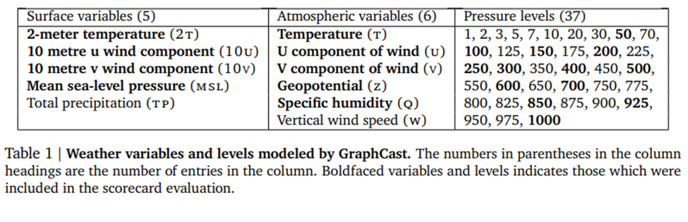

### **1\. Objective**

This workflow aims to evaluate the physical consistency of GraphCast ML model outputs by examining geostrophic balance. Specifically, we assess how well the model-reconstructed wind field aligns with the theoretical geostrophic wind derived from pressure gradients.

The method will later be adapted for other ML models (e.g., CorrDiff), but GraphCast is used for the initial implementation and validation.

###

### **2\. Theoretical Background**

Geostrophic balance assumes equilibrium between the Coriolis force and pressure gradient force, valid for large-scale, slowly varying atmospheric motions.

In pressure coordinates:

$$
u_g=-\frac{1}{f} \frac{\partial \Phi}{\partial y}, \quad v_g=\frac{1}{f} \frac{\partial \Phi}{\partial x}
$$

Where:
- $\Phi=g z$ is the geopotential
- $f=2 \Omega \sin (\phi)$ is the Coriolis parameter
- $x, y$ are spatial coordinates in Cartesian space (converted from lat/lon)

### **3\. Input data**

**GraphCast Outputs Required (as Input):**

| **Variable Type** | **Variable Name** | **Pressure Levels (hPa)** |
| --- | --- | --- |
| Geopotential | z   | 850 (later 500–925) |
| U wind component | u   | 850 |
| V wind component | v   | 850 |
| Latitude, Longitude | lat, lon | —   |

Latitude range: 30°N to 80°N and 30°S to 80°S

Longitude range: Global (0° to 360°)

850 hPa is chosen as a mid-tropospheric level, commonly used for geostrophic wind analysis.

**All Graphcast Outputs**

**Spatial Resolution Considerations:**

- Geostrophic balance reflects large-scale atmospheric flow and may not hold at high resolutions where mesoscale features dominate. Since GraphCast outputs have a ~25 km resolution, spatial smoothing (e.g., to 0.5°) may be applied to better assess geostrophic balance. The need for and extent of smoothing will be evaluated as part of the framework design.

###

### **4\. Workflow Steps**

#### **Step 1: Compute Geopotential Gradients and Calculate Geostrophic Wind**

- Work directly on the native lat/lon grid to avoid regridding errors
- Use metpy.calc.geospatial_gradient, which accounts for spherical geometry
- Compute the Coriolis parameter from latitude
- Apply geostrophic wind equations using the calculated gradients

#### **Step 2: Extract Actual Wind**

- Extract u and v wind components at 850 hPa from GraphCast output
- Interpolate or align spatial resolution if necessary

#### **Step 3: Compute Deviations**

$\Delta u = u - u_g,\quad \Delta v = v - v_g$

$\text{RMSE}_u = \sqrt{\frac{1}{N} \sum (\Delta u)^2},\quad \text{RMSE}_v = \sqrt{\frac{1}{N} \sum (\Delta v)^2}$ 

$\text{RMSE}_{\text{wind}} = \sqrt{\frac{1}{N} \sum \left[(u - u_g)^2 + (v - v_g)^2\right]}$

Also use relative metrics - ratio of the ageostrophic component to the geostrophic wind:

$r=\frac{\left|\vec{v}_{a g}\right|}{\left|\vec{v}_g\right|}$

#### **Step 4: Compare to ERA5 Baseline**

- Apply the same geostrophic wind computation to ERA5 geopotential and wind data
- Compute RMSE for ERA5
- Define skill score:

$\text{Skill}=\frac{RMSE_{\text{ERA5}}-RMSE_{\text{GraphCast}}}{RMSE_{\text{ERA5}}+RMSE_{\text{GraphCast}}}$

+1 = perfect prediction (zero error)   
0 = same as ERA5  
–1 = very poor (RMSE much higher than baseline)

#### **Step 5: Mask Dynamically Active Regions (Optional)**

- Compute vorticity or geopotential height gradients
- Define a threshold to mask high-dynamic regions (e.g., near jet streams, fronts)
- Evaluate metrics separately for active regions

#### **Step 6: Visualization and Diagnostics**

- Plot spatial difference maps
- Histograms of errors (by latitude, season, etc.)
- Scatter plot (eg. geostrophic vs actual wind - should be near 1:1 line)
- Optional: spectral analysis of wind field

###

### **5\. Results (Planned Output)**

- Skill score values compared to ERA5 (later comparison also with other models, as in Weather Bench 2)
- RMSE variation across pressure levels (when implemented)
- Visuals: difference maps, scatter plots, histograms, etc.

### **6\. Future Extensions and Ideas**

- Apply to additional pressure levels. Final framework should allow testing across 500–925 hPa
- Extend to other ML models
- Define acceptable spatial resolution thresholds
- Explore balance metrics during extreme events (e.g., deep cyclones, storms, fronts)
- In addition to RMSE, consider including complementary metrics such as MAE, bias, spread, realative metrics, ...

### Tools and Libraries

- **xarray, numpy, dask, pytorch** – data handling and computing
- **metpy** – gradient, Coriolis parameter
- **matplotlib** – plotting and mapping
- **cdsapi** – data access (ERA5)
